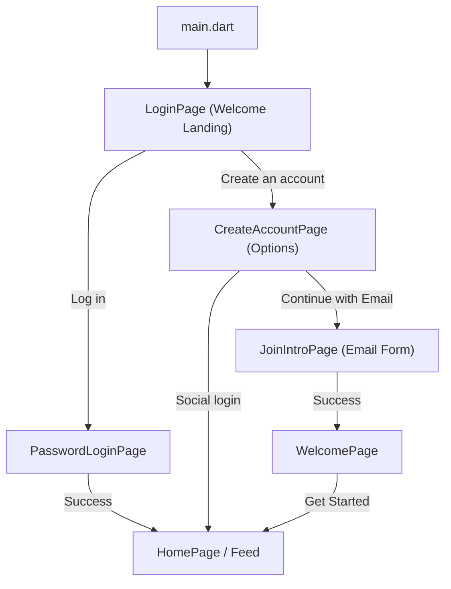

# WETHERE - Codebase Documentation

> **⚠️ AGENT MAINTENANCE PROTOCOL**  
> Any agent (human or AI) working on this codebase **MUST**:
> 1. Read this file FIRST before making changes
> 2. **Run `flutter test` BEFORE making changes** — all tests must pass
> 3. Make changes
> 4. **Run `flutter test` AFTER making changes** — all tests must still pass
> 5. Update this file IMMEDIATELY after modifying files or architecture
> 6. Document date, change type, and reason in the [Change Log](#change-log)
> 7. **Include test pass/fail results in your task completion message**

---

## Table of Contents
- [Project Overview](#project-overview)
- [Tech Stack](#tech-stack)
- [File Structure](#file-structure)
- [Testing](#testing)
- [Component Reference](#component-reference)
- [User Flow Mapping](#user-flow-mapping)
- [Common Tasks](#common-tasks)
- [Change Log](#change-log)

---

## Project Overview

**Togetherness** (by WeThere) is a social platform that connects people for daily activities and events to combat loneliness. Users can:
- Create and join activities/events
- Find companions who share similar interests
- Build meaningful connections

---

## Branding Guidelines

### App vs Organization Names

- **App Name:** Togetherness
  - This is the product users interact with
  - Use in: main headers, page titles, welcome messages, primary branding
  - Styling: prominent, large, primary color (orange)

- **Organization Name:** WeThere
  - This is the company/team behind the app
  - Use in: footers, copyright notices, about sections
  - Styling: subtle, smaller, muted colors (gray/hint)
  - Format: "by WeThere" or "© WeThere"

### Tech Stack

| Category | Technology |
|----------|------------|
| Framework | Flutter (Dart) |
| SDK Version | ^3.8.1 |
| Backend | Firebase |
| Auth | Firebase Authentication |
| Database | Cloud Firestore |
| Storage | Firebase Storage |
| Image Handling | image_picker |

### Architecture Pattern

Simple **screen-based architecture** with:
- `/lib/screens/` - All UI screens
- `/lib/theme/` - Centralized theming
- No state management library (uses StatefulWidget)

---

## File Structure

```
WETHERE/
├── lib/
│   ├── main.dart                    # App entry point + Firebase init
│   ├── firebase_options.dart        # Firebase configuration (auto-generated)
│   ├── screens/
│   │   ├── welcome_page.dart        # Landing page
│   │   ├── login_page.dart          # Login options screen
│   │   ├── password_login.dart      # Email/password login
│   │   ├── create_account.dart      # Sign-up intro page
│   │   ├── join_page.dart           # Sign-up form
│   │   ├── create_profile_page.dart # Profile completion
│   │   ├── home_page.dart           # Main Feed/Profile tabs
│   │   ├── find_account_page.dart   # Password recovery
│   │   └── verify_code_page.dart    # Email verification
│   └── theme/
│       └── app_theme.dart           # Colors, typography, buttons
├── test/
│   ├── helpers/
│   │   ├── mock_data.dart           # Mock profiles, journeys, users
│   │   ├── test_helpers.dart        # Widget wrappers, common finders
│   │   └── mock_services.dart       # Provider wrappers for widget tests
│   ├── unit/
│   │   ├── journey_model_test.dart  # JourneyModel logic tests
│   │   ├── profile_validation_test.dart  # Profile form validation
│   │   └── profile_completion_test.dart  # SharedPreferences tests
│   ├── widget/
│   │   ├── create_profile_page_test.dart  # Profile form UI tests
│   │   ├── create_journey_page_test.dart  # Journey creation UI tests
│   │   └── profile_prompt_test.dart       # Profile prompt dialog tests
│   └── widget_test.dart             # Basic app widget test
├── assets/
│   ├── icon/icon.png                # App icon
│   └── images/                      # Static images
├── android/                         # Android platform config
├── ios/                             # iOS platform config
├── web/                             # Web platform config
└── pubspec.yaml                     # Dependencies
```

---

## Testing

### Running Tests

```bash
# Run all tests
flutter test

# Run only unit tests
flutter test test/unit/

# Run only widget tests
flutter test test/widget/

# Run a specific test file
flutter test test/unit/journey_model_test.dart

# Run with verbose output
flutter test --reporter expanded
```

### Test Coverage (102 tests)

| Category | File | Tests | What It Covers |
|----------|------|-------|----------------|
| Unit | `journey_model_test.dart` | 18 | Badge text/color for all 4 compensation types, toMap serialization, toUiMap, defaults |
| Unit | `profile_validation_test.dart` | 19 | Step 1/2/3 validation logic, error messages, mock data integration |
| Unit | `profile_completion_test.dart` | 10 | SharedPreferences storage, progress save/clear |
| Widget | `create_profile_page_test.dart` | 19 | 3-step form rendering, fields, progress persistence, step navigation |
| Widget | `create_journey_page_test.dart` | 16 | Form fields, all 4 compensation types, conditional fields, validation |
| Widget | `profile_prompt_test.dart` | 13 | Prompt for create/join, buttons, cancel, close, dynamic text |
| Widget | `widget_test.dart` | 1 | MaterialApp basic rendering |
| **Total** | | **102** | |

### Writing New Tests

1. **Unit tests** → `test/unit/` — Pure logic, no widgets, no Firebase
2. **Widget tests** → `test/widget/` — UI tests with `pumpWidget`
3. Use helpers from `test/helpers/mock_data.dart` for consistent test data
4. Use `test/helpers/test_helpers.dart` for `wrapWithMaterialApp()` and common finders
5. **Firebase limitation**: Screens that import Firebase services cannot be directly widget-tested. Use the "standalone replica" pattern (see `create_journey_page_test.dart`) to test the same UI in isolation.

### ⚠️ Mandatory Test Requirements for All Agents

1. **Before changes**: Run `flutter test` — all 102 tests must pass
2. **After changes**: Run `flutter test` — all tests must still pass
3. **New features**: Write tests for new functionality
4. **Report results**: Include test count and pass/fail in completion message
5. **Never merge broken tests**: If a test fails, fix it before completing your task

---

## Component Reference

### Core Files

| File | Purpose | Key Functions |
|------|---------|---------------|
| [main.dart](lib/main.dart) | App entry, Firebase init | `main()` |
| [app_theme.dart](lib/theme/app_theme.dart) | Design system | Colors, TextStyles, ButtonStyles |

### Screen Files

| File | Purpose | Navigates To | Key Method |
|------|---------|--------------|------------|
| [welcome_page.dart](lib/screens/welcome_page.dart) | Success page (new users) | `HomePage` | - |
| [login_page.dart](lib/screens/login_page.dart) | Login options | `PasswordLoginPage`, `JoinUnicityPage` | `sendSignInLink()` |
| [password_login.dart](lib/screens/password_login.dart) | Email/password login | `HomePage` | `loginUser()` |
| [create_account.dart](lib/screens/create_account.dart) | Sign-up intro | `JoiningUnicityPage` | - |
| [join_page.dart](lib/screens/join_page.dart) | Sign-up form | `WelcomePage` | `_createAccount()` |
| [create_profile_page.dart](lib/screens/create_profile_page.dart) | Profile setup (optional) | `HomePage` | `_saveProfile()`, `_pickImage()` |
| [create_journey_page.dart](lib/screens/create_journey_page.dart) | Journey creation (4-step) | `HomePage` | `_createJourney()` |
| [home_page.dart](lib/screens/home_page.dart) | Main app (Feed + Profile) | `CreateJourneyPage` | `_buildFeedTab()`, `_buildProfileTab()` |

> [!NOTE]
> **Complete Your Profile - Multi-Step Form**  
> - 3-step wizard: About You → Interests → Details
> - Profile completion is **optional** (accessible via "Edit Profile" in Profile tab)
> - Uses SharedPreferences for progress persistence
> - Profile completion check is enforced before Create/Apply journey actions
> - `isProfileComplete()` helper function checks both SharedPreferences and Firestore

---

## Navigation Structure

### Bottom Navigation (4 tabs)

1. **Explore** - Browse all available journeys
2. **My Journeys** - Manage user's journeys (Active, Created, Applied, Past) + Create Journey
3. **Inbox** - Messages and notifications
4. **Profile** - User profile and settings

### My Journeys Sub-tabs

| Tab | Purpose |
|-----|---------|
| Active | Merged view of Ongoing and Upcoming journeys (Hosted + Applied) |
| Applications | Journeys currently applied to + Journeys you host with applicants |
| Past | Completed/archived journeys |

### Journey Creation

- Accessed via "+ Create" button in My Journeys header
- Opens modal bottom sheet (full creation flow coming soon)
- After creation, journey appears in "Created" tab

---

## Compensation Models

Togetherness supports four compensation types for journeys:

### 1. Hourly Pay (Orange Badge)
- Host pays companion an hourly rate
- Badge: `$15/h` format
- Example: `$15/h` for groceries shopping

### 2. Free Item/Ticket (Green Badge)
- Host provides free ticket, entry, or item of value
- Badge: `🎫 Free Ticket` or `🎨 Free Entry`
- Example: Free concert ticket, free museum entry

### 3. Covered Expense (Teal Badge)
- Host pays for companion's expenses during journey
- Badge: `🍽️ Dinner Covered` or `☕ Coffee On Me`
- Example: Dinner up to $50, coffee and pastry

### 4. Companion's Choice (Purple Badge)
- Host offers TWO options, companion chooses when applying
- Badge: `$20/h OR 🎬 Free`
- Example: $20/h OR Free movie ticket

---

## User Flow Mapping

### Welcome & Authentication Flow (Updated)

**First Screen:**
- Welcome page with "Togetherness" title
- Two options: "Create an account" or "Log in"

**New User (Sign Up):**
```
User opens app
    ↓
[login_page.dart] → Welcome landing ("Togetherness" + two buttons)
    ↓ taps "Create an account"
[create_account.dart] → Sign-up options (Email / Google / Apple)
    ↓ taps "Continue with Email"
[join_page.dart] → Email signup form (name, email, phone, password)
    ↓ _createAccount() → Firebase.createUserWithEmailAndPassword()
[welcome_page.dart] → "Get Started" button (ONLY for new users)
    ↓
[home_page.dart] ← FEED
```

**Returning User (Log In):**
```
User opens app
    ↓
[login_page.dart] → Welcome landing
    ↓ taps "Log in"
[password_login.dart] → Email + password + social buttons
    ↓ loginUser() → Firebase.signInWithEmailAndPassword()
[home_page.dart] ← FEED
```

### Journey Creation

Users can create journeys from multiple entry points:

1. **Explore Page FAB**: Floating action button (bottom-right, orange "+")
2. **My Journeys Header**: "+ Create" button
3. **Empty Explore State**: When no journeys exist, "Create Journey" button

All entry points:
- Call `_showCreateJourneyDialog()` in `home_page.dart`
- Check if user profile is complete via `_checkProfileAndProceed()`
- Show "Complete Your Profile" prompt if incomplete
- Open `CreateJourneyPage` if profile is complete
- Use consistent orange styling and behavior

### Visual Navigation Map


---

## Common Tasks

### Add a New Screen
1. Create file in `lib/screens/new_screen.dart`
2. Import `AppTheme` for consistent styling
3. Add navigation from source screen using `Navigator.push()`
4. Update this documentation

### Modify Navigation Logic
| To change... | Edit file |
|--------------|-----------|
| Post-login destination | `password_login.dart` → `loginUser()` |
| Post-signup destination | `join_page.dart` → `_createAccount()` |
| Post-profile destination | `create_profile_page.dart` → `_saveProfile()` |
| App start screen | `main.dart` → `home:` property |

### Update Authentication
| Task | File |
|------|------|
| Login logic | `password_login.dart` → `loginUser()` |
| Signup logic | `join_page.dart` → `_createAccount()` |
| Password reset | `find_account_page.dart` |
| Firebase config | `firebase_options.dart` |

### Modify the Feed
| Task | File | Method |
|------|------|--------|
| Feed UI | `home_page.dart` | `_buildFeedTab()` |
| Post cards | `home_page.dart` | `_buildPostCard()` |
| Profile tab | `home_page.dart` | `_buildProfileTab()` |
| Create post | `home_page.dart` | `_showPostDialog()` |

### Update Styling
| Task | File |
|------|------|
| Colors | `app_theme.dart` → Color constants |
| Typography | `app_theme.dart` → TextStyle constants |
| Buttons | `app_theme.dart` → `primaryButtonStyle` |
| Input fields | `app_theme.dart` → `buildInputDecoration()` |
| Spacing | `app_theme.dart` → Spacing constants |

---

## Change Log

| Date | Change Type | Files Modified | Reason |
|------|-------------|----------------|--------|
| 2026-02-16 | Feature | `create_profile_page.dart` | Made profile photo required on its own dedicated Step 0. Profile now 4 steps: Photo → About You → Interests → Details |
| 2026-02-16 | Feature | `join_page.dart`, `create_profile_page.dart`, `home_page.dart`, `location_page.dart` [NEW] | Added email verification, DOB (18+), safety tips modal. Moved location to dedicated post-signup screen with skip option. Flow: Signup → Location → Welcome → Home |
| 2026-02-15 | UI Polish | `login_page.dart`, `create_account.dart`, `pubspec.yaml` | Added hero image to welcome page, enhanced Apple button hover effect, added hover+cursor to "Log in" link |
| 2026-02-15 | Feature | `home_page.dart` | Added FAB to Explore page and improved empty state for easier journey creation. Three entry points now: Explore FAB, My Journeys header, and empty state CTA. All check profile completion first. |
| 2026-02-15 | Testing | `test/` (9 new files) | Added comprehensive testing framework: 102 tests covering JourneyModel, profile validation, profile form UI, journey creation UI, and profile prompt dialog. Created test helpers and mock data. Updated agent protocol to require tests before/after changes. |
| 2026-02-01 | Fix/Feature | `create_profile_page.dart`, `home_page.dart` | Restored multi-step profile form with actual fields (bio, occupation, languages, interests, journey types, ethnicity, availability, communication, transportation); added profile completion prompt before Create/Apply journey actions |
| 2026-01-18 | Feature | `home_page.dart`, `chat_page.dart`, `review_dialog.dart` | Implemented Inbox tab, real-time Chat, and Review submission |
| 2026-01-04 | Logic | `home_page.dart` | Merged Active/Upcoming into single Active tab, fixed date logic, enabled Applicant View for hosts |
| 2025-12-16 | Feature | `home_page.dart` | Added filtering (compensation type, price range, date) and sorting to Explore |
| 2025-12-16 | Feature | `create_journey_page.dart` [NEW] | 4-step journey creation with compensation selection |
| 2025-12-16 | Feature | `home_page.dart` | Added reward selection modal for Companion's Choice journeys |
| 2025-12-16 | Layout | `create_account.dart` | Pushed footer to bottom using LayoutBuilder, ConstrainedBox, Spacer |
| 2025-12-14 | Feature | `home_page.dart` | Added 4 compensation types with color-coded badges |
| 2025-12-14 | Navigation | `home_page.dart` | Restructured nav: Explore, My Journeys (4 sub-tabs), Inbox, Profile |
| 2025-12-14 | UI Update | `app_theme.dart`, `login_page.dart`, `password_login.dart` | Enhanced hover effects with darker colors, added pointer cursors |
| 2025-12-14 | Branding | `login_page.dart`, `password_login.dart`, `create_account.dart`, `main.dart` | Updated app name to 'Togetherness', added 'by WeThere' footer |
| 2025-12-14 | Enhancement | `join_page.dart` | Converted sign-up to 2-step with password strength, photo, DOB |
| 2025-12-14 | Enhancement | `create_profile_page.dart` | Added 3-step profile form with progress, validation, localStorage |
| 2025-12-14 | Restructure | `welcome_page.dart`, `home_page.dart` | Made profile completion optional, accessible via Edit Profile |
| 2025-12-14 | Content | `create_account.dart` | Updated Join Community page with WETHERE-specific messaging |
| 2025-12-14 | UI Update | `app_theme.dart`, all screens | Applied orange color scheme, consistent hover effects |
| 2025-12-14 | Restructure | `main.dart`, `welcome_page.dart`, `join_page.dart` | Changed app entry to LoginPage, WelcomePage only after signup |
| 2025-12-13 | Redesign | `home_page.dart` | Redesigned Feed with Journey cards, search bar, 4-tab nav |
| 2025-12-13 | Fix | `main.dart` | Added Firebase initialization |
| 2025-12-13 | Fix | `create_profile_page.dart` | Changed `dart:io` → `dart:typed_data` for Web |
| 2025-12-13 | Fix | `password_login.dart`, `join_page.dart`, `create_profile_page.dart` | Fixed navigation to `HomePage` |
| 2025-12-13 | Create | `CODEBASE_DOCUMENTATION.md` | Initial documentation |

---

> **Last Updated:** 2026-02-15  
> **Maintained By:** Development Team
